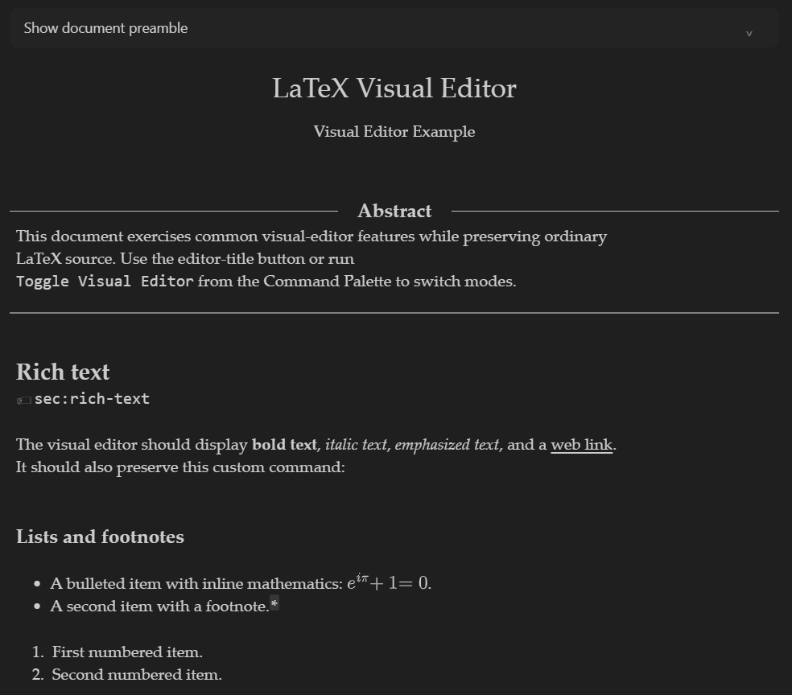

# LaTeX Visual Editor

A VS Code extension that provides a visual editor for LaTeX documents. It is inspired by Overleaf's visual editor and uses the same interface and parser.

## Usage

Open a `.tex` file and click the eye icon in the editor title bar to toggle the
visual editor.

## Features

### Visual editing

- Document structure: titles, authors, headings, lists, theorems, proofs captions, footnotes, and endnotes
- Technical content: inline/display math, citations, references, labels, glossary entries, links, colors, special characters, and code listings
- Media: figures, SVGs, tables, and included listings
- Editor: folding, line numbers and default theme

### Editing tools

- Figure insertion, editing, deletion, upload, paste, and drag-and-drop
- Editable tables with cell previews, multi-cell selection, copy/paste,
and row or column deletion
- Formatted HTML paste for headings, styles, links, lists, quotations, code, and tables
- Completion for LaTeX commands, environments, citations, labels, packages, classes, files, graphics, and bibliography styles

### VS Code integration

- Synchronized source and visual editing
- Preserved selection, cursor position, and editor view
- SyncTeX navigation through LaTeX Workshop
- Standard keybindings for find, copy, paste, italic, bold, build, SyncTeX, folding

